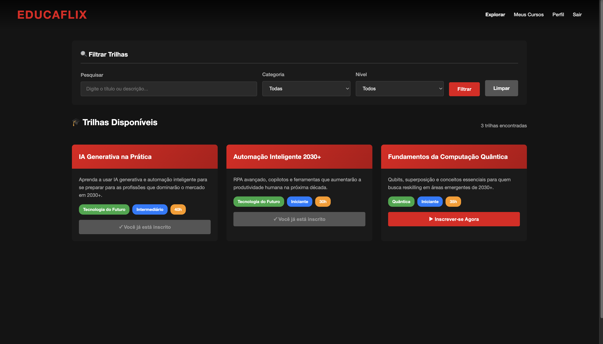

# 🎓 EducaFlix - Plataforma de Upskilling/Reskilling para 2030+

 


Aplicação web desenvolvida em **Java Spring Boot**, seguindo o padrão **MVC**, utilizando **JPA** para persistência e **Thymeleaf** para renderização de interfaces. O sistema tem como objetivo gerenciar **trilhas de aprendizagem** e apoiar o **desenvolvimento de competências para o futuro do trabalho**, integrando a **Global Solution 2025 da FIAP**, cujo tema é **“O Futuro do Trabalho”**, com foco em **upskilling** e **reskilling** para preparar profissionais para as demandas do mercado até 2030 e além.

---

## 👥 Equipe
- **Camila Feitosa** – RM 558808
- **Milena Garcia** – RM 555111
- **Steffany Medeiros** – RM 556262

---

## ✅ Requisitos Funcionais

### 1. Cadastro de Usuários
- O sistema suporta **dois tipos de usuários**: **Alunos** e **Profissionais**.
- Cada usuário possui: **nome, e-mail, CPF, senha e tipo de conta (role)**.
- **Alunos** possuem **área de interesse**.
- **Profissionais** possuem **área de atuação** e **código de professor**.
- O sistema valida **CPF** utilizando o algoritmo oficial de validação.
- Verifica **duplicação de e-mail** antes de permitir o cadastro.
- Acesso ao sistema controlado por **login e senha** com redirecionamento automático para o painel correto.

### 2. Gerenciamento de Trilhas de Aprendizagem
- Cada trilha possui: **título, descrição, categoria, carga horária e nível** (Iniciante, Intermediário, Avançado).
- **Profissionais** podem **criar, editar e excluir** trilhas de aprendizagem.
- A exclusão de uma trilha também remove **todas as inscrições vinculadas**, garantindo a integridade referencial.
- Sistema de **filtros avançados** por categoria, nível e busca textual.

### 3. Sistema de Inscrições
- **Alunos** podem se inscrever em trilhas disponíveis.
- O sistema valida se o aluno já está inscrito na trilha, exibindo mensagem apropriada.
- **Alunos** podem visualizar suas inscrições e **finalizar cursos**.
- **Profissionais** podem visualizar todos os alunos inscritos em suas trilhas.
- **Profissionais** podem remover inscrições de alunos.

### 4. Painéis Personalizados
- **Painel do Aluno:**
  - Explorar trilhas disponíveis com filtros.
  - Ver e gerenciar inscrições.
  - Finalizar cursos concluídos.
  - Editar perfil pessoal.

- **Painel do Profissional:**
  - Criar e gerenciar trilhas de aprendizagem.
  - Visualizar e gerenciar alunos inscritos.
  - Editar perfil profissional.

### 5. Interface e Usabilidade
- **Design inspirado na Netflix** com tema escuro e vermelho (#e50914).
- **Interface moderna** com cards interativos, hover effects e animações suaves.
- **Sistema de filtros em tempo real** integrado ao backend.
- **Mensagens de erro e sucesso** integradas à interface.
- **Design totalmente responsivo** (mobile, tablet e desktop).
- **Navbar fixa** com efeito de scroll.

---

## 🔧 Requisitos Técnicos

### Tecnologias Utilizadas
- **Java 17+**
- **Spring Boot 3.x** (dependências Web, JPA, Thymeleaf, Validation e Security).
- **Thymeleaf** para renderização de páginas HTML no servidor.
- **Spring Data JPA** para persistência de dados.
- **Spring Security** para autenticação e autorização.
- **H2 Database** (banco de dados em memória para desenvolvimento).
- **Bean Validation** para validação de dados.
- **CSS externo** para estilização centralizada.
- **JavaScript** para interatividade (filtros, máscaras e animações).

### Arquitetura
- **Padrão MVC** (Model-View-Controller).
- **Arquitetura em Camadas** (Controller → Service → Repository).
- **Tratamento Centralizado de Exceções** com `@RestControllerAdvice`.
- **Exceções Customizadas** para diferentes tipos de erro:
  - `ResourceNotFoundException` (404)
  - `ValidationException` (400)
  - `DuplicateResourceException` (422)

### Validações Implementadas
- ✅ Validação de CPF com algoritmo oficial.
- ✅ Verificação de e-mail duplicado.
- ✅ Validação de campos obrigatórios com Bean Validation.
- ✅ Validação de inscrição duplicada.
- ✅ Tratamento de erros com mensagens amigáveis.

## 🧪 Testes de Endpoints

### Autenticação

#### Login
```bash
curl -X POST http://localhost:8080/login \
-H "Content-Type: application/x-www-form-urlencoded" \
-d "email=aluno@email.com&senha=senha123" \
-c cookies.txt
```

---

### Cadastro de Usuários

#### Cadastro de Aluno
**URL:** `POST http://localhost:8080/cadastro`

**Payload (Form Data):**
```
nome=Novo Aluno
email=novo.aluno@email.com
senha=senha123
cpf=12345678909
role=ALUNO
areaInteresse=Tecnologia
```

**Exemplo cURL:**
```bash
curl -X POST http://localhost:8080/cadastro \
-H "Content-Type: application/x-www-form-urlencoded" \
-d "nome=Novo Aluno&email=novo.aluno@email.com&senha=senha123&cpf=12345678909&role=ALUNO&areaInteresse=Tecnologia"
```

#### Cadastro de Profissional
**URL:** `POST http://localhost:8080/cadastro`

**Payload (Form Data):**
```
nome=Novo Profissional
email=novo.prof@email.com
senha=senha456
cpf=98765432101
role=PROFISSIONAL
areaAtuacao=Engenharia de Software
codigoProfessor=PROF123
```

**Exemplo cURL:**
```bash
curl -X POST http://localhost:8080/cadastro \
-H "Content-Type: application/x-www-form-urlencoded" \
-d "nome=Novo Profissional&email=novo.prof@email.com&senha=senha456&cpf=98765432101&role=PROFISSIONAL&areaAtuacao=Engenharia de Software&codigoProfessor=PROF123"
```

---

### Gerenciamento de Trilhas (Profissional)

#### Criar Trilha
**URL:** `POST http://localhost:8080/profissional/trilhas`

**Payload (Form Data):**
```
titulo=Introdução ao Spring Boot
descricao=Aprenda os fundamentos do Spring Boot
categoria=Desenvolvimento
cargaHoraria=40
nivel=Iniciante
```

**Exemplo cURL:**
```bash
curl -X POST http://localhost:8080/profissional/trilhas \
-H "Content-Type: application/x-www-form-urlencoded" \
-d "titulo=Introdução ao Spring Boot&descricao=Aprenda os fundamentos do Spring Boot&categoria=Desenvolvimento&cargaHoraria=40&nivel=Iniciante" \
-b cookies.txt
```

#### Editar Trilha
**URL:** `POST http://localhost:8080/profissional/trilhas/{id}/editar`

**Payload (Form Data):**
```
titulo=Spring Boot Avançado
descricao=Tópicos avançados em Spring Boot
categoria=Desenvolvimento
cargaHoraria=60
nivel=Avançado
```

**Exemplo cURL:**
```bash
curl -X POST http://localhost:8080/profissional/trilhas/1/editar \
-H "Content-Type: application/x-www-form-urlencoded" \
-d "titulo=Spring Boot Avançado&descricao=Tópicos avançados em Spring Boot&categoria=Desenvolvimento&cargaHoraria=60&nivel=Avançado" \
-b cookies.txt
```

#### Excluir Trilha
**URL:** `POST http://localhost:8080/profissional/trilhas/{id}/excluir`

**Exemplo cURL:**
```bash
curl -X POST http://localhost:8080/profissional/trilhas/1/excluir \
-b cookies.txt
```

---

### Inscrições (Aluno)

#### Inscrever-se em Trilha
**URL:** `POST http://localhost:8080/aluno/trilhas/{trilhaId}/inscrever`

**Exemplo cURL:**
```bash
curl -X POST http://localhost:8080/aluno/trilhas/1/inscrever \
-b cookies.txt
```

#### Finalizar Curso
**URL:** `POST http://localhost:8080/aluno/inscricoes/{id}/finalizar`

**Exemplo cURL:**
```bash
curl -X POST http://localhost:8080/aluno/inscricoes/1/finalizar \
-b cookies.txt
```

## ▶️ Como Executar

### Pré-requisitos
- **Java 17** ou superior instalado.
- **Maven 3.6+** instalado.

### Passo a Passo

1. **Clone o repositório:**
   ```bash
   git clone https://github.com/medeirossteffany/EducaFlix.git
   cd EducaFlix
   ```

2. **Compile o projeto:**
   ```bash
   mvn clean install
   ```

3. **Execute a aplicação:**
   ```bash
   mvn spring-boot:run
   ```

4. **Acesse no navegador:**
   ```
   http://localhost:8080
   ```


**EducaFlix** - Preparando profissionais para o futuro do trabalho! 🚀
